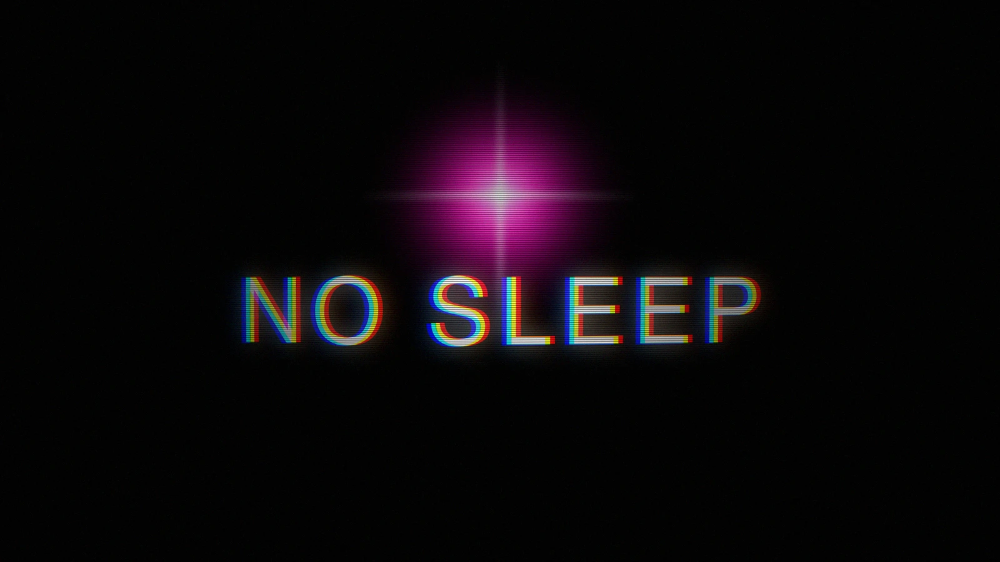
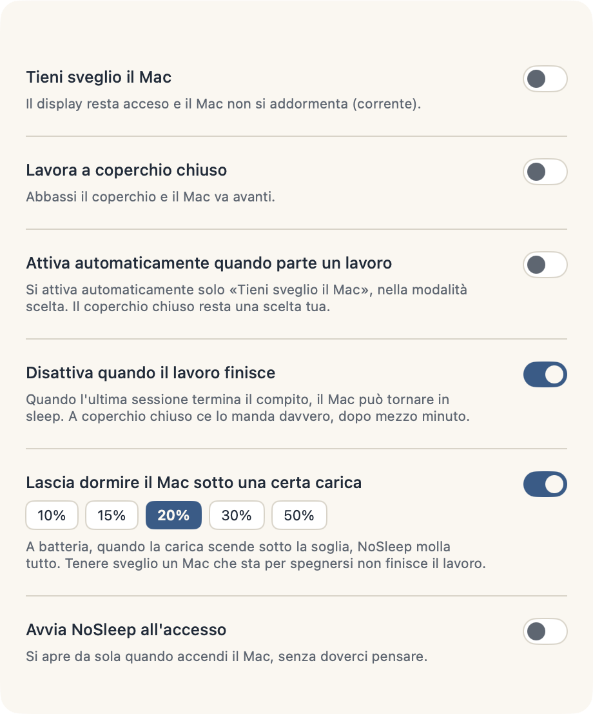

<div align="center">
  
  <h1>NoSleep</h1>
  <p><strong>Keeps your Mac awake for as long as the work actually lasts, on battery and with the lid shut, then lets it sleep again without being told.</strong></p>
</div>

<p align="center">
  
  
  
  
  <a href="LICENSE"></a>
</p>

You start a long build, close the lid, and put the laptop in a bag. Ten minutes
later the Mac is asleep and the build is not running. So next time you turn on a
keep-awake app first. That works, and then you forget to turn it off, and the Mac
spends the night awake in the bag on battery.

Those two are the same bug. Every keep-awake app hands you a switch and asks a
question you cannot answer: how long will this take? Two hours? Until you say
stop? You do not know how long the render takes, and the app knows less than you
do.

The job knows. So let the job say it.

```
$ nosleep hold --id render --ttl 7200 --label "final render"
$ nosleep hold --id sync   --ttl 600  --label "photo sync"

  two jobs alive      the Mac stays up, lid shut, on battery
  sync finishes       still up, the render is still alive
  render finishes     asleep a moment later, nobody had to remember
```

Sleep is the default here. Staying awake is a claim, claims are counted, and every
claim expires.

## Claims, and why they always expire

Anything can take one. A shell script, a Makefile, a cron job, your editor's build
task, an AI agent working through a queue:

```sh
nosleep hold --id nightly --ttl 3600 --label "nightly build"
nosleep status          # 1 job running
nosleep list            # ids, labels, and how long each has left
nosleep release --id nightly
```

They are counted, so with two sessions alive the first one to leave turns nothing
off. And a claim **always** has a deadline. Without one, a process that dies
mid-flight would leave its claim behind and your Mac would never sleep again, with
nothing to tell you why. The deadline is the difference between a job that forgot
to clean up and a machine that is broken until you reboot it.

## In the menu bar

|  | When |
|---|---|
| `zzz` | the Mac is free to sleep |
| the hollow bolt | work is running, the display may switch off |
| the filled bolt | work is running **and** the display stays on |

The filled glyph marks the heavier state, which is what makes the two readable at
a glance without a legend.

**There used to be a horse there.** For a few days the working state was
Muybridge's galloping horse, redrawn as a halftone of dots, fifteen poses
generated from masks. It left the menu bar on 12 August because it cost 19.9% of
a core: an animated icon is not paid for in drawing it, it is paid for in
interface redraws, and measuring that was the interesting part. The code is still
here and still green under `--selftest-horse`. Putting it back is one line in
`Icons.glyph`.

## The lid

This is the part most tools get wrong, and the reason is worth stating. Close the
lid and macOS puts the Mac to sleep in a fraction of a second, while an app polling
every few seconds finds out about it after the fact, from the wrong side of being
asleep. There is no reacting to it. The only moment the decision can still be made
is **before**.

So the lid is armed ahead of time, together with "keep awake", and released with
it. The price, stated plainly: while armed, sleep stays disabled with the lid open
too. What closes that loop is "release when the work ends", which is on by default.

The rule works on the **edge**, not the state. A lid switch you turned off by hand
does not come back on a second later, and a lid switch you turned on by hand is
never turned off by the rule. An app that fights your hand is worse than one that
does nothing.

## Two things you cannot switch off

**The watchdog.** Working with the lid shut means writing `SleepDisabled` into
system power preferences, and that key outlives the app that wrote it. If the
return to normal depended on the app, then "the app crashed" would be exactly the
case left uncovered, and your Mac would stay awake forever without telling anyone.
So the decision belongs to a small root process instead: the app sends it a
heartbeat every five seconds, and after thirty seconds of silence it puts sleep
back the way it found it. It does the same at boot, before reading any request.

**The thermal release.** When macOS reports `serious` thermal pressure, NoSleep
drops everything. Not because something is about to break, since 100°C on the die
is ordinary on Apple Silicon and the chip already defends itself by slowing down.
It drops because at that point you are paying heat for *less* work, so keeping the
Mac awake has stopped serving the purpose you turned it on for.

There is a third one you can switch off but probably should not: on battery, below
20%, everything is released.

## The switches

| Switch | What it does | Ships |
|---|---|---|
| **Keep the Mac awake** | Holds the display on and blocks idle sleep. Works on battery. | off |
| **Work with the lid closed** | The Mac does not sleep with the lid down, and wifi stays connected. | off |
| **Arm the lid whenever the Mac is kept awake** | Shut the screen and the work carries on, without having planned for it. | off |
| **Release when the work ends** | When the last claim goes, drop everything. | **on** |
| **Arm automatically when work starts** | The first claim turns "keep awake" on by itself. | off |
| **Release below 20% on battery** | A floor, chosen from 10/15/20/30/50. | **on** |



## With Claude Code

Claims are taken and returned for you, so agent sessions keep the Mac up exactly
while they are working:

| Event | What happens |
|---|---|
| session starts | a short claim, five minutes, covering startup jobs rather than the whole session |
| you send a prompt | renewed for six hours, because now there is real work |
| the turn ends | cut back to two minutes of grace |
| session ends | returned |

Opening a terminal is not working, which is why the claim at startup is small. The
turn ending is not the work ending either: a session that fires off a background
agent and waits would lose its claim while the work is still running, so when the
turn ends a small watcher checks whether the session still has live child processes
and holds the claim up while it does. It extends but never creates, raises but
never lowers, and has to see the work twice before believing in it.

## Build it

```sh
swift test              # 60 tests
Scripts/build-app.sh    # builds, signs, installs to /Applications, puts `nosleep` in ~/.local/bin
```

The panel photographs itself, and so does the menu bar:

```sh
.build/release/NoSleepApp --scatta panel.png --chiaro --sveglio   # or --scuro
.build/release/NoSleepApp --barra bar.png                         # three shots of the real menu bar
```

Each probe runs in a home of its own and never touches the running app.

## Check that it is actually doing something

Both assertions are named so you can find them:

```sh
pmset -g assertions | grep "NoSleep - "
defaults read /Library/Preferences/com.apple.PowerManagement SystemPowerSettings
```

## Heat

The closed lid is meant for **short** windows. With the Mac in a bag the heat has
nowhere to go, and the part that really ages in the heat is the battery. Low power
mode helps, and on a stock Mac it is already on for battery (`pmset -g custom`, the
`powermode` line).

## Requirements

macOS 15 or later. Built and verified on macOS 26.5.2, Apple M4 Max.

No network, no telemetry, no account.
